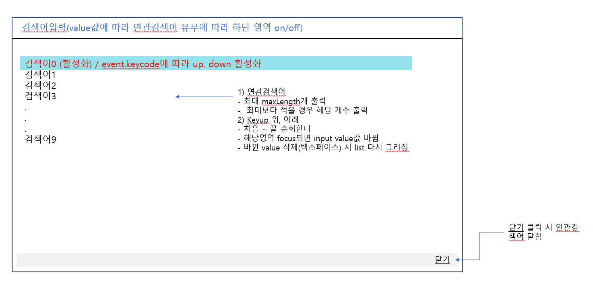

# Carousel-js

# 생성방법
``` javascript
    const search = new formSearch('#search', 10);
    search.setInit();
```

# etoy 요구사항

- [x] 검색어를 입력하면 자동완성결과가 노출된다. (최대 10개)

- [x] 백스페이스로 삭제시 일치하는 자동완성 결과가 노출된다.

- [x] 자동완성결과는 키보드 위아래로 이동할 수 있다.

- [x] 자동완성결과에서 키보드로 위아래 입력시 배경이 바뀐다.

- [x] 자동완성결과를 엔터 또는 submit 실행시 콘솔에 검색창에 입력된것이 콘솔로 노출한다.
> form submit 이벤트를 잘 몰라서 수호님 스터디 중에 만들었던걸 참고해서 만들어 뒀는데 이게 맞는지 의문...

# 설계도

